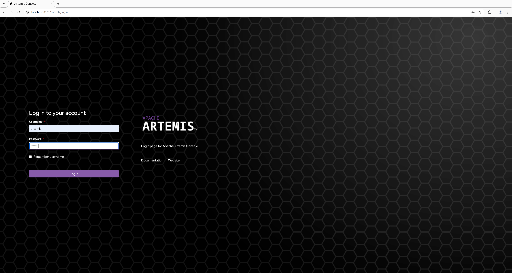

= Management Console
:idprefix:
:idseparator: -
:docinfo: shared

{project-name-full} ships by default with a management console powered by http://hawt.io[Hawt.io].

== Security

The management console communicates with the broker via HTTP(S).
The broker uses the https://jolokia.org/[Jolokia JMX-HTTP bridge] to convert the contents of these HTTP requests into a JMX operations and then returns the results.

Security for Jolokia is configured via `etc/jolokia-access.xml`.
You can read more about the contents of this file in the https://jolokia.org/reference/html/manual/security.html[Jolokia Security Guide].
By default the console is locked down to `localhost`.
Pay particular attention to the `<cors>` restrictions when exposing the console web endpoint over the network.

[NOTE]
====
Any request with an `Origin` header using the HTTPS scheme which is ultimately received by Jolokia via HTTP is discarded by default since it is deemed insecure.
If you use a TLS proxy that transforms secure requests to insecure requests (e.g. in a Kubernetes environment) then consider changing the proxy to preserve HTTPS and switching the embedded web server to HTTPS.
If that isn’t feasible then you can accept the risk by specifying following element

[,xml]
----
<cors>
    ...
    <ignore-scheme/>
    ...
</cors>
----
====

Problems with Jolokia security are often observed as the ability to login to the console, but the console is blank.

=== Logging In

To access the management console, use a browser and go to the URL link:[http://localhost:8161/console].

A login screen will be presented.
If your broker is secured, you will need to use a user with admin role.
If it is unsecured, enter any user/password.

Once logged in check out the https://artemis.apache.org/components/artemis-console/documentation/version/${artemis-console-version}[Artemis Console documentation] for details on how to use the console.

== Status Logging

When the broker starts it will detect the presence of the web console and log status information, e.g.:

----
INFO  [org.apache.activemq.artemis] AMQ241002: Artemis Jolokia REST API available at http://localhost:8161/console/jolokia
INFO  [org.apache.activemq.artemis] AMQ241004: Artemis Console available at http://localhost:8161/console
----

The web console is detected by inspecting the value of the `<display-name>` tag in the war file's `WEB-INF/web.xml` descriptor.
By default it looks for `hawtio`.
However, if this value is changed for any reason the broker can look for this new value by setting the following system property

----
-Dorg.apache.activemq.artemis.webConsoleDisplayName=newValue
----
